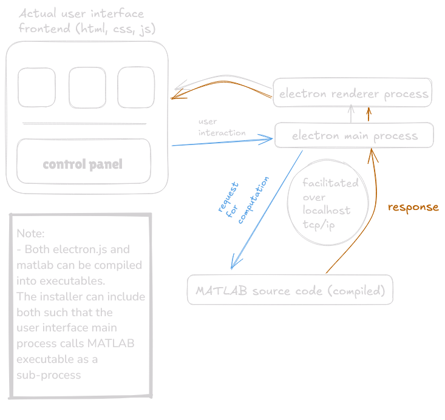

# ElectronIC
Electron-based Instrumentation and Control; A scaffolding for controlling MATLAB based I&amp;C applications using Electron

## Status
*This projects is still underdevelopment, this documentation and codebase does not reflect the finished intended results*

### TODO

- [x] Demonstrate Basic Communication between MATLAB and Node.js
- [ ] Create Electron.js template and demonstrate more advanced command of MATLAB
- [ ] Evaluate the remote evaluation of custom functions
- [ ] Demonstrate seamless image transmission over localhost
## Concept


## Setup 

### Required Software
- MATLAB (Tested on R2024a)
    - Instrumentat Control Toolbox (v24.1)
- [Node.js](https://nodejs.org/en) (v20.14.0 or greater)

### Recommended Software
- [Visual Studio Code](https://code.visualstudio.com/)

### Setting up Development Environment

1. *Clone* this repository into your desired folder. 
    + Guides are available here:
        + https://github.com/git-guides/git-clone   
        + https://www.geeksforgeeks.org/how-to-git-clone-a-remote-repository/
        + *This can also be accomplished using* [Github Desktop](https://desktop.github.com/download/)

2. Open the codebase in **MATLAB**
3. Navigate into the codebase using a terminal, or using **VSCODE**
4. Install the javascript code using *Node.js* using the following command:
    ```javascript
    npm install .
    ```
    + This will install all necessary packages to `node_modules` in the local folder you ran the command from.
5. Run `matlab_socket_server.m` using the MATLAB IDE
    + Navigate to the *Editor* tab and select `Run`
    + You should recived an output that looks like this in the *Command Window*
    ```matlab
    >> matlab_socket_server
    Server is running on port 3000...
    ```
6. Run the node.js side using 

    ```javascript
    node index.js
    ```

7. If all has been setup correctly, you should see the following on the javascript side:

    ```javascript
    Connected to MATLAB server
    Received response from MATLAB server: {"status":"success","result":4}

    Response from MATLAB: {"status":"success","result":4}
    ```

    + And the following on the MATLAB side:

    ```MATLAB
    Data received from: 127.0.0.1
    Data is: 2+2
    Evaluated response is {"status":"success","result":4}
    ```

    + *NOTE*: You may be prompted on windows with a **Firewall* popup when using the `tcpserver` function for the first time. Make sure to check off `public` and `private` networks.
